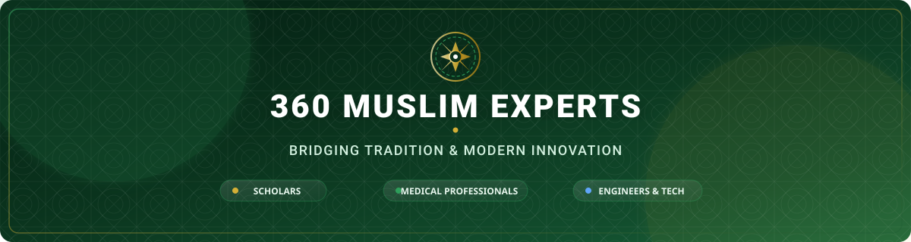

<!-- ═══════════════════════════════════════════════════════════════════════════ -->
<!--                    360 MUSLIM EXPERTS — OFFICIAL ORG PROFILE                 -->
<!-- ═══════════════════════════════════════════════════════════════════════════ -->

  <!-- Main Hero Banner -->
  

    

  <!-- Dynamic Typing Tagline -->
  

   

  <!-- Quick Nav & Key Links -->
  

    
    
    
    
  

  <!-- Live Stats Badges -->
  

    
    
    
  

---

## 🌟 About the Organization

**360 Muslim Experts** is an international professional network dedicated to uniting Islamic scholars, medical practitioners, engineers, researchers, and creative professionals. Headquartered in Lahore, Pakistan, our mission is to empower the global Ummah by harmonizing authentic traditional knowledge with modern scientific and technological innovation.

Through structured collaborative forums, skill-building programs, and humanitarian drives, we cultivate a multi-disciplinary ecosystem focused on constructive social impact, intellectual leadership, and community welfare.

 

<table align="center" width="100%">
<tr>
<td width="50%" valign="top">

### 🎯 Strategic Pillars

| | Pillar | Objective |
|---|---|---|
| 📖 | **Authentic Education** | Disseminating verified Islamic knowledge and literature |
| 🩺 | **Healthcare Synergy** | Fostering medical awareness and professional networking |
| 💻 | **Tech Innovation** | Building open-source digital tools & platform solutions |
| 🤝 | **Humanitarian Service** | Direct student support, social welfare & outreach |
| 🏆 | **Talent Acceleration** | Research tracks, creative media & skill mentoring |

</td>
<td width="50%" valign="top">

### 💡 Core Values & Ethos

- **Beneficial Knowledge (*'Ilm Nafi'*)** — Prioritizing actionable, high-impact education.
- **Self-Sufficiency** — Equipping youth with modern technological & career skills.
- **Collaborative Leadership** — Uniting cross-functional experts under one vision.
- **Humanitarian Compassion** — Serving vulnerable communities with empathy and dignity.
- **Excellence (*Ihsan*)** — Adhering to the highest standards in design, code, and service.

</td>
</tr>
</table>

---

## 🏛️ Executive Leadership & Governance

Strategic Steering & Operational Oversight

 

<table align="center" width="100%">
<tr>
<td align="center" width="33%">

### Dr. Zain Abbas
**Founder**
Visionary & Strategic Lead

</td>
<td align="center" width="33%">

### Dr. Sarim Shaoor
**Central President**
Organizational Leadership

</td>
<td align="center" width="33%">

### Hira Amjad
**Central Vice President**
Strategic Oversight & Governance

</td>
</tr>
<tr>
<td align="center" width="33%">

### Ayesha Sarfaraz
**Operational Director**
Day-to-day Management

</td>
<td align="center" width="33%">

### Aamish Manzoor
**Head — 360 Medico Forum**
Medical Wing Leadership

</td>
<td align="center" width="33%">

### Ibtisam Shahid
**Head — Technical Department**
Digital & Technical Innovation

</td>
</tr>
</table>

---

## 👥 Specialist Departmental Core

 

<table align="center" width="100%">
<thead>
<tr>
<th align="left">Member</th>
<th align="left">Role / Designation</th>
<th align="left">Departmental Division</th>
</tr>
</thead>
<tbody>
<tr>
<td><b>Afsheen Zulfiqar</b></td>
<td>Religious Forum Member</td>
<td>📖 Religious & Authentic Knowledge Forum</td>
</tr>
<tr>
<td><b>Ubaid ur Rehman</b></td>
<td>Technical Department Member</td>
<td>💻 Technical & Software Engineering</td>
</tr>
<tr>
<td><b>Syed Muhammad Hammad</b></td>
<td>Technical Department Member</td>
<td>💻 Technical & Infrastructure Development</td>
</tr>
<tr>
<td><b>Muhammad Khubab-ul-Haq</b></td>
<td>Art Team Member</td>
<td>🎨 Creative Arts & Visual Media</td>
</tr>
<tr>
<td><b>Pakeeza Wajid Zaman</b></td>
<td>Graphics Designer</td>
<td>🎨 Brand Identity & Graphic Design</td>
</tr>
</tbody>
</table>

---

## 🚀 Flagship Initiatives

 

<table align="center" width="100%">
<tr>
<td width="50%" valign="top">

### 🏆 National Talent Hunt (NTH)
Our primary nationwide platform for empowering emerging writers, researchers, and scientific scholars across the Ummah.

- **Research Papers:** In-depth academic studies on contemporary issues.
- **Articles & Essays:** Writing tracks for students & young professionals.
- **Mentorship:** Feedback and publication support for high-potential entries.

</td>
<td width="50%" valign="top">

### 🩺 360 Medico Forum
A specialized platform connecting doctors, medical students, and healthcare workers for professional development and public health awareness.

- **Awareness Campaigns:** Community health drives and preventative education.
- **Medical Networking:** Peer collaboration & clinical case discussions.
- **Educational Webinars:** Expert-led medical research sessions.

</td>
</tr>
<tr>
<td width="50%" valign="top">

### 📚 Educational & Skill Programs
Comprehensive workshops, Quranic circles, and technical bootcamps tailored to modern workplace needs.

- **Technical Bootcamps:** Web development, programming, and design.
- **Islamic Studies:** Authentic learning circles and guided modules.
- **Certifications:** Verified certificates for completed tracks.

</td>
<td width="50%" valign="top">

### 🤝 Social Welfare & Campaigns
Direct community support projects driving tangible impact where help is needed most.

- **Student Assistance:** Academic support & resource distribution.
- **Orphanage & Welfare Visits:** Compassionate care and basic aid.
- **Awareness Drives:** Public drives highlighting critical societal topics.

</td>
</tr>
</table>

---

## 🛠 Tech Stack & Digital Toolkit

Technologies, Frameworks & Tools Powering Our Platform Solutions

 

  

 

<table align="center">
<tr>
<td align="center"><b>Frontend &amp; UI</b></td>
<td align="center"><b>Backend &amp; Core</b></td>
<td align="center"><b>Design &amp; Workflow</b></td>
</tr>
<tr>
<td>
  
  
  
  
</td>
<td>
  
  
  
</td>
<td>
  
  
  
</td>
</tr>
</table>

---

## 🤝 Get Involved & Contribute

We actively welcome developers, designers, writers, doctors, scholars, and volunteers from across the globe.

 

<table align="center" width="100%">
<tr>
<td align="center" width="33%">

### 💡 Propose Ideas
Found a bug or have a feature idea?

 

</td>
<td align="center" width="33%">

### 🛠 Submit Code
Want to contribute code or design?

 

</td>
<td align="center" width="33%">

### ✉️ Partner With Us
Interested in strategic collaboration?

 

</td>
</tr>
</table>

---

## 🌐 Connect Across Our Channels

 

  

<!-- Footer SVG Banner -->

 

© 2026 <b>360 Muslim Experts Organization</b> · All Rights Reserved · Lahore, Pakistan

